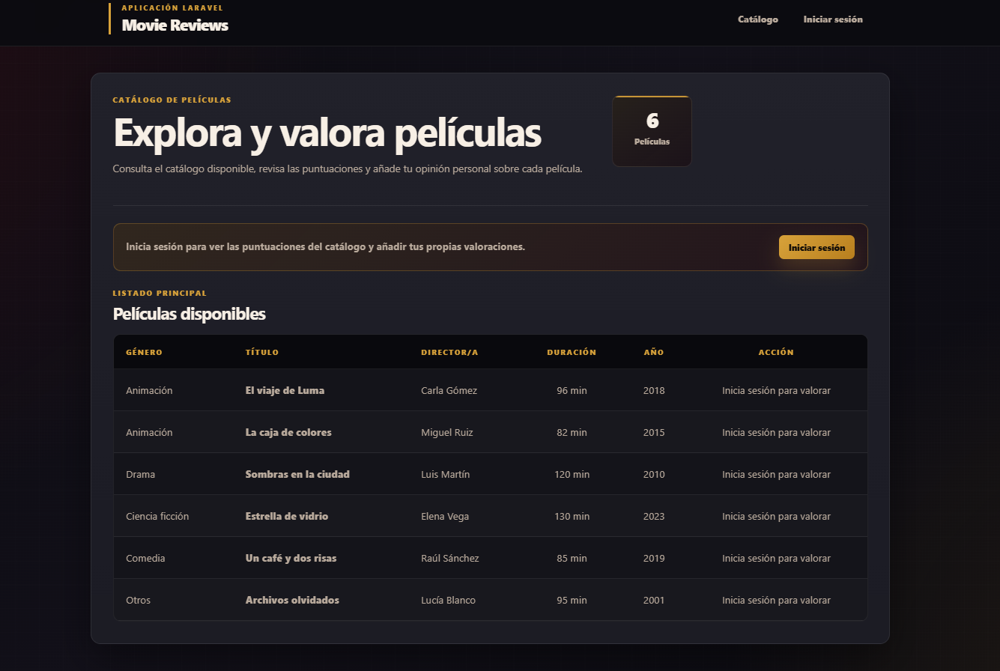
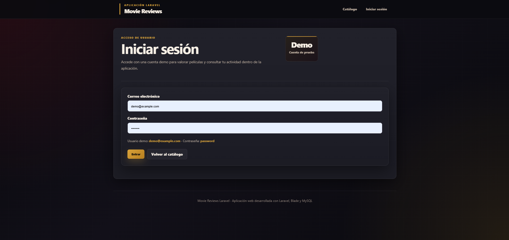
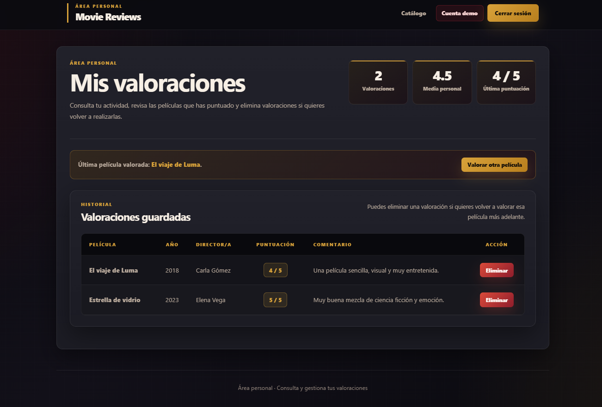
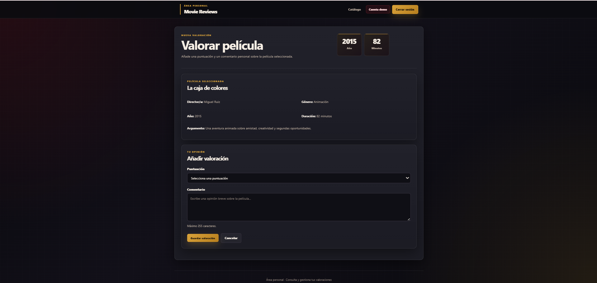
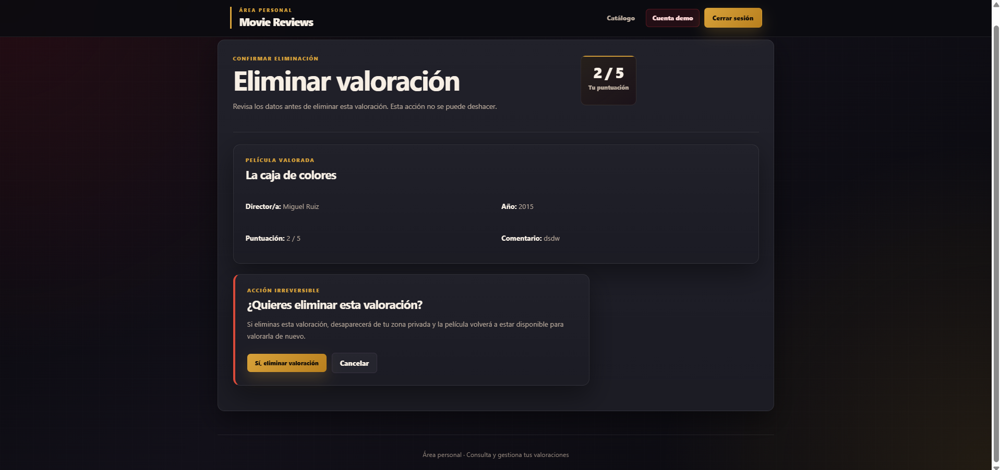

# Movie Reviews Laravel

Aplicación web desarrollada con **Laravel 10** para consultar un catálogo de películas, iniciar sesión con una cuenta demo y gestionar valoraciones personales.

El proyecto permite a un usuario autenticado valorar películas, consultar sus valoraciones guardadas y eliminar valoraciones propias desde una zona privada.

## Vista general

Movie Reviews Laravel es una aplicación sencilla de catálogo y reseñas de películas. Incluye una zona pública donde se muestran las películas disponibles y una zona privada donde cada usuario puede consultar y gestionar sus valoraciones.

Proyecto personal desarrollado para practicar Laravel, Blade y MySQL, con autenticación, rutas protegidas, validación de formularios y relaciones entre modelos.

## Funcionalidades

* Catálogo público de películas.
* Inicio y cierre de sesión.
* Zona privada para usuarios autenticados.
* Valoración de películas con puntuación y comentario.
* Control para evitar que un usuario valore dos veces la misma película.
* Listado de valoraciones personales.
* Eliminación de valoraciones propias.
* Datos iniciales de prueba mediante seeders.
* Interfaz responsive con diseño personalizado en CSS.

## Tecnologías utilizadas

* PHP 8.1
* Laravel 10
* Blade
* MySQL
* HTML5
* CSS3
* Composer
* Vite

## Estructura principal

```text
app/
├── Http/Controllers/
│   ├── Auth/LoginController.php
│   └── ValoracionController.php
├── Models/
│   ├── Genero.php
│   ├── Pelicula.php
│   ├── User.php
│   └── Valoracion.php

database/
├── migrations/
└── seeders/
    ├── DatabaseSeeder.php
    └── DemoDataSeeder.php

resources/
└── views/
    ├── auth/
    ├── layouts/
    ├── privada/
    ├── valoraciones/
    ├── mensaje.blade.php
    └── principal.blade.php

public/
└── css/styles.css

routes/
└── web.php
```

## Instalación

Clona el repositorio:

```bash
git clone https://github.com/ledesmamaria/movie-reviews-laravel.git
cd movie-reviews-laravel
```

Instala las dependencias de PHP:

```bash
composer install
```

Instala las dependencias de Node:

```bash
npm install
```

Copia el archivo de entorno:

```bash
copy .env.example .env
```

En Linux o Mac:

```bash
cp .env.example .env
```

Genera la clave de la aplicación:

```bash
php artisan key:generate
```

Configura la base de datos en el archivo `.env`:

```env
DB_DATABASE=movie_reviews_laravel
DB_USERNAME=root
DB_PASSWORD=
```

Crea la base de datos `movie_reviews_laravel` en MySQL.

Ejecuta las migraciones y los seeders:

```bash
php artisan migrate:fresh --seed
```

Inicia el servidor local:

```bash
php artisan serve
```

Abre el proyecto en el navegador:

```text
http://localhost:8000
```

## Usuario demo

Puedes iniciar sesión con la siguiente cuenta de prueba:

```text
Email: demo@example.com
Contraseña: password
```

## Datos de prueba

El proyecto incluye seeders con:

* usuarios demo;
* géneros de películas;
* películas de ejemplo;
* valoraciones iniciales.

Esto permite probar la aplicación desde el primer momento después de ejecutar:

```bash
php artisan migrate:fresh --seed
```

## Tests

El proyecto incluye tests de Feature para comprobar la lógica principal de la aplicación.

Los tests verifican que:

* el catálogo público se puede visualizar correctamente;
* un usuario puede iniciar sesión;
* un usuario autenticado puede crear una valoración;
* un usuario no puede valorar dos veces la misma película;
* un usuario no puede eliminar valoraciones creadas por otro usuario.

Para ejecutar los tests:

```bash
php artisan test
```

## Capturas de pantalla

### Catálogo de películas



### Inicio de sesión



### Zona privada



### Formulario de valoración



### Confirmación de eliminación



## Qué demuestra este proyecto

Este proyecto demuestra conocimientos prácticos de desarrollo web con Laravel:

* creación de rutas públicas y privadas;
* uso de controladores;
* autenticación de usuarios;
* validación de formularios;
* relaciones entre modelos;
* migraciones y seeders;
* consultas con Eloquent;
* protección de acciones por usuario autenticado;
* uso de plantillas Blade;
* diseño responsive con CSS personalizado;
* creación de tests de Feature para validar funcionalidades principales.

## Estado del proyecto

Proyecto completado.

Posibles mejoras futuras:

* buscador de películas;
* filtros por género;
* edición de valoraciones;
* subida de imágenes o pósters;
* paginación del catálogo;
* sistema de registro de usuarios;
* despliegue online.

## Autora

Desarrollado por **María Ledesma** como proyecto de portfolio de desarrollo web.
